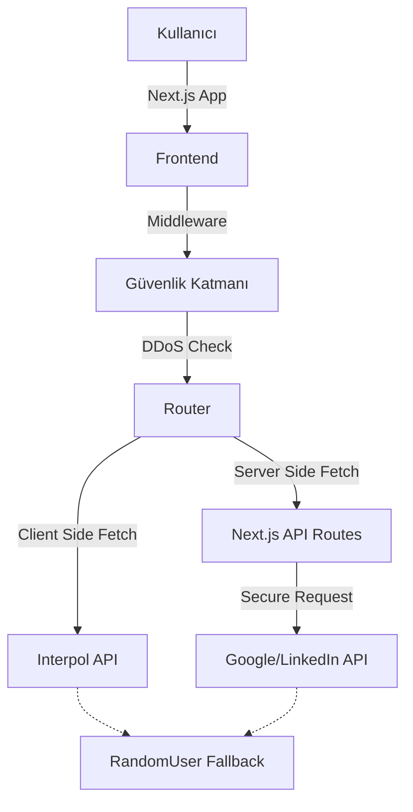

# 🕵️‍♂️ Vatandaş Kontrol - OSINT Simülasyonu

<div align="center">
  
  **🌍 Languages:**
  [🇬🇧 English](README_EN.md)
  
</div>

<div align="center">

[](https://nextjs.org/)
[](https://www.typescriptlang.org/)
[](https://tailwindcss.com/)
[](https://vercel.com/)
[](https://nextjs.org/)

</div>

## 📋 İçindekiler / Table of Contents

- [Proje Hakkında](#-proje-hakkında)
- [Özellikler](#-özellikler)
- [Güvenlik ve Gizlilik](#-güvenlik-ve-gizlilik)
- [Teknolojiler](#-teknolojiler)
- [Mimari](#-mimari)
- [Kurulum](#-kurulum)
- [Yapılandırma](#-yapılandırma)
- [Yasal Uyarı](#-yasal-uyarı)

---

## 📖 Proje Hakkında

**Vatandaş Kontrol**, Açık Kaynak İstihbarat (OSINT) yöntemlerini oyunlaştıran minimalist bir web simülasyonudur.

Kullanıcılar, ekrana gelen profillerin masum bir sivil (LinkedIn) mi yoksa Interpol tarafından aranan bir suçlu (Red Notice) mu olduğunu analiz etmeye çalışır. Proje, gerçek zamanlı API verilerini kullanır ve yüksek güvenlik önlemleri ile donatılmıştır.

## ✨ Özellikler

- **Çift Oyun Modu:**
  - ⏱️ _Zamana Karşı:_ 60 saniye içinde maksimum doğru tahmini yapın.
  - 🎯 _Hedef Modu:_ Belirtilen sayıda (örn: 20) analizi tamamlayın.
- **Hibrit Veri Mimarisi:**
  - **Client-Side:** IP engellemelerini aşmak için Interpol verilerini doğrudan tarayıcıdan çeker.
  - **Server-Side:** API anahtarlarını korumak için LinkedIn verilerini sunucudan çeker.
- **Akıllı Çeviri:** İngilizce, İspanyolca ve Fransızca suç tanımlarını otomatik olarak Türkçe'ye çevirir.
- **Offline Zırhı:** İnternet kesilse bile oyunun çalışmasını sağlayan "Nuclear Fallback" sistemi.
- **Görsel Zekası:** Eksik fotoğraflar için otomatik placeholder ve stilize edilmiş arayüz.

## 🛡️ Güvenlik ve Gizlilik

Bu proje **"Military-Grade"** güvenlik protokolleri ile korunmaktadır:

### 1. Anti-DDoS Kalkanı (Middleware)

- **Rate Limiting:** IP başına saniyede belirli sayıda istek limiti.
- **Token Bucket:** Ani trafik artışlarını (burst) kontrol altında tutar.

### 2. Anti-Hacker Önlemleri

- **Tamper Koruması:** `F12`, `Sağ Tık`, `Ctrl+U`, `Ctrl+Shift+I` gibi geliştirici araçları engellenmiştir.
- **Debugger Tuzakları:** Kodun incelenmesini zorlaştıran otomatik debugger kesiciler.
- **Konsol Koruması:** Tarayıcı konsolunun açılması durumunda sistem kilitlenir.

### 3. Gizlilik (Privacy First)

- **No-Log:** Kullanıcı IP adresleri veya verileri asla saklanmaz.
- **No-Store:** Önbellek (Cache) kapatılarak iz bırakılması engellenir.
- **Header Hardening:**
  - `Strict-Transport-Security` (HSTS)
  - `X-Frame-Options: DENY` (Clickjacking koruması)
  - `Referrer-Policy: no-referrer`
  - `X-Content-Type-Options: nosniff`

## 💻 Teknolojiler

- **Core:** Next.js 14 (App Router), React
- **Language:** TypeScript
- **Styling:** Tailwind CSS, Framer Motion (Animasyonlar)
- **Icons:** Lucide React
- **HTTP:** Axios
- **APIs:** Interpol Red Notice API, Google Custom Search API, RandomUser API

## 🏗️ Mimari

Proje, Vercel Edge Network üzerinde optimize edilmiş hibrit bir yapı kullanır:



## 🚀 Kurulum

Projeyi yerel ortamınızda çalıştırmak için:

1. **Depoyu klonlayın:**

   ```bash
   git clone https://github.com/kullaniciadi/vatandas-kontrol.git
   cd vatandas-kontrol
   ```

2. **Bağımlılıkları yükleyin:**

   ```bash
   npm install
   ```

3. **Geliştirme sunucusunu başlatın:**
   ```bash
   npm run dev
   ```

## ⚙️ Yapılandırma

LinkedIn verilerini çekebilmek için `.env.local` dosyasını oluşturun:

```env
GOOGLE_API_KEY=sizin_api_anahtariniz
GOOGLE_CX=sizin_arama_motoru_id
```

## ⚠️ Yasal Uyarı

Bu proje **EĞİTİM VE SİMÜLASYON** amaçlı geliştirilmiştir.

- **Interpol Verileri:** Uluslararası kamuya açık bültenlerdir.
- **LinkedIn Verileri:** Kişisel Verileri Koruma Kanunu (KVKK) ve GDPR kapsamında korunmaktadır. Projede kullanılan sivil veriler temsilidir veya anonimleştirilmiştir.
- Sistemin gerçek bir istihbarat aracı olarak kullanılması önerilmez.

---

<div align="center">

**Geliştirici:** [@sketur60](https://instagram.com/sketur60)

Created with ❤️ & ☕

</div>
