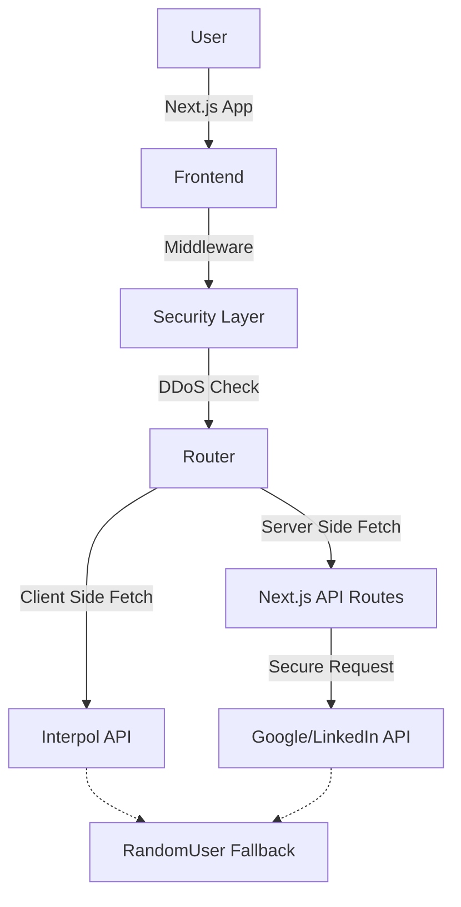

# 🕵️‍♂️ Vatandaş Kontrol - OSINT Simulation

<div align="center">
  
  **🌍 Diller:**
  [🇹🇷 Türkçe](README.md)
  
</div>

<div align="center">

[](https://nextjs.org/)
[](https://www.typescriptlang.org/)
[](https://tailwindcss.com/)
[](https://vercel.com/)
[](https://nextjs.org/)

</div>

## 📋 Table of Contents

- [About](#-about)
- [Features](#-features)
- [Security & Privacy](#-security--privacy)
- [Technologies](#-technologies)
- [Architecture](#-architecture)
- [Installation](#-installation)
- [Configuration](#-configuration)
- [Disclaimer](#-disclaimer)

---

## 📖 About

**Vatandaş Kontrol** (Citizen Control) is a minimalist web simulation gamifying Open Source Intelligence (OSINT) methods.

Players analyze incoming profiles to determine if they are innocent civilians (LinkedIn profiles) or criminals wanted by Interpol (Red Notices). The project utilizes real-time API data and is fortified with high-level security measures.

## ✨ Features

- **Dual Game Modes:**
  - ⏱️ _Time Attack:_ Make maximum correct guesses within 60 seconds.
  - 🎯 _Quantity Mode:_ Complete a set number of analyses (e.g., 20).
- **Hybrid Data Architecture:**
  - **Client-Side:** Fetches Interpol data directly from the browser to bypass server IP blocks.
  - **Server-Side:** Fetches LinkedIn data via server to protect API keys.
- **Smart Translation:** Automatically translates crime descriptions from English, Spanish, and French into Turkish/Local language.
- **Offline Armor:** "Nuclear Fallback" system ensures the game runs even if internet connectivity is lost.
- **Visual Intelligence:** Automatic placeholders and stylized UI for missing data/images.

## 🛡️ Security & Privacy

This project is protected by **"Military-Grade"** security protocols:

### 1. Anti-DDoS Shield (Middleware)

- **Rate Limiting:** Request limits per IP per second.
- **Token Bucket:** Controls traffic bursts effectively.

### 2. Anti-Hacker Measures

- **Anti-Tamper:** Blocks developer tools like `F12`, `Right Click`, `Ctrl+U`, `Ctrl+Shift+I`.
- **Debugger Traps:** Implements breakpoints to disrupt code inspection.
- **Console Protection:** Locks the system if the browser console is opened.

### 3. Privacy First

- **No-Log:** User IP addresses or data are never stored.
- **No-Store:** Caching is disabled to prevent data traces.
- **Header Hardening:**
  - `Strict-Transport-Security` (HSTS)
  - `X-Frame-Options: DENY` (Clickjacking protection)
  - `Referrer-Policy: no-referrer`
  - `X-Content-Type-Options: nosniff`

## 💻 Technologies

- **Core:** Next.js 14 (App Router), React
- **Language:** TypeScript
- **Styling:** Tailwind CSS, Framer Motion (Animations)
- **Icons:** Lucide React
- **HTTP:** Axios
- **APIs:** Interpol Red Notice API, Google Custom Search API, RandomUser API

## 🏗️ Architecture

The project uses an optimized hybrid structure on the Vercel Edge Network:



## 🚀 Installation

To run the project locally:

1. **Clone the repository:**

   ```bash
   git clone https://github.com/username/vatandas-kontrol.git
   cd vatandas-kontrol
   ```

2. **Install dependencies:**

   ```bash
   npm install
   ```

3. **Start the development server:**
   ```bash
   npm run dev
   ```

## ⚙️ Configuration

Create a `.env.local` file to enable LinkedIn data fetching:

```env
GOOGLE_API_KEY=your_api_key
GOOGLE_CX=your_search_engine_id
```

## ⚠️ Disclaimer

This project is developed for **EDUCATIONAL AND SIMULATION** purposes.

- **Interpol Data:** Sourced from international public notices.
- **LinkedIn Data:** Protected under GDPR/KVKK. Civilian data used in this project is representative or anonymized.
- Not recommended for use as a real intelligence tool.

---

<div align="center">

**Developer:** [@sketur60](https://instagram.com/sketur60)

Created with ❤️ & ☕

</div>
